# Module 01

> Capabilities, not tools. Learning the basics of AI coding tools is great, and we will cover that. But the real value is learning how to create your own systematic approach to using an AI coding assistant that is reliable and repeatable.

## How to develop your own AI coding workflows

### Primary mental model for AI coding

1. Planning
2. Implementation
3. Validation
4. Iteration

### Step 1: Planning

Start with a "vibe plan":
- Explore ideas, architecture, concepts, and tech stack choices with the AI coding assistant.
- Keep this phase exploratory before enforcing strict structure.

For new projects:
- Research online resources.
- Review previous projects and patterns you can reuse.

For existing projects:
- Analyze the current codebase and documentation first.

#### Layer 1: Foundation planning

Done once and updated rarely:
- Tech stack decisions
- Architecture patterns
- Constraints and conventions
- Stable reference resources

#### Layer 2: Task planning

Done for each feature or task:
- Codebase analysis
- Documentation analysis
- Integration points
- Task-specific rules

### Step 2: Create a structured plan with the components of context engineering

The goal is to produce a detailed plan of attack for the AI coding assistant based on your conversation and planning work.

Your plan can include:

- Goals
- Success criteria
- Documentation references
- Task list
- Validation strategies
- Desired codebase structure

### Step 3: Implement and validate

Execute the implementation plan task by task. Most structure should already be set up during planning, so this phase focuses on execution quality.

Trust, but verify.

1. You can allow the AI coding assistant to move quickly, but monitor it to ensure it:
    - Uses tools correctly
    - Reads and edits the right files
    - Manages tasks in the correct order
    - Produces reasoning that matches the planned approach

2. Validate the produced code continuously:
    - Run tests and checks after each meaningful change
    - Compare outcomes against your success criteria
    - Confirm integrations behave as expected

### Step 4: Iterate

Use validation results to refine the plan and repeat the cycle:
1. Update context and constraints
2. Adjust the task plan
3. Re-implement where needed
4. Re-validate until the feature is complete

## The AI Coding System Gap

> How can AI coding assistants be simultaneously extremely capable and still disappointing for many developers?

### Example: Same request, different outcomes

```mermaid
flowchart TD
    C[👤 Customer request:<br/>Build a filter feature for a product catalog]

    C --> D1
    C --> D2

    subgraph S1[Path A]
        D1[👨‍💻 Developer 1<br/>using Claude Code]
        D1 --> O1[30 minutes<br/>Feature works, but:<br/>- Over-engineered solution<br/>- No testing<br/>- Awkward UI<br/>- No documentation]
        O1 --> R1[All fit to the developer's specification]
    end

    subgraph S2[Path B]
        D2[👩‍💻 Developer 2<br/>using Claude Code]
        D2 --> O2[10 minutes<br/>Feature works with:<br/>- Simple code<br/>- Complete testing<br/>- Clean UI<br/>- Documented code]
    end
```

